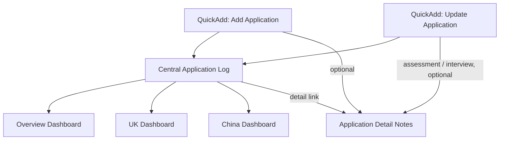

# Obsidian Job Application Management System

A metadata-driven job application workflow built with **Obsidian**, **QuickAdd**, **Dataview**, and **JavaScript**.

The system is designed for high-volume job searching without creating one note for every application. A central structured log stores application metadata and recruitment status, while dedicated detail notes are created only for high-priority roles, assessments, interviews, or applications that require deeper preparation.

## What it does

- Unified application entry workflow with country-specific fields, demonstrated for the UK and China
- Stable application IDs for reliable updates
- Duplicate-application warning
- Recruitment-stage and deadline tracking
- Automatic process-history logging
- Optional application detail pages
- Automatic detail-page creation when an application reaches assessment/interview stages
- Priority, career-track, source, sponsorship, and CV-version metadata
- Real-time overview and country-specific dashboards powered by Dataview
- Separation between structured tracking data and deeper application research

## Architecture



The central log is the single source of truth for status and deadlines. Detail notes deliberately do **not** duplicate live recruitment status.

## Repository layout

```text
.
├── README.md
├── LICENSE
├── .gitignore
├── docs/
│   ├── architecture.md
│   └── data-model.md
└── example-vault/
    └── 03 Work/
        ├── Application Database.md
        └── Job Search/
            ├── 00 Dashboard/
            │   ├── Overview.md
            │   ├── Applications - UK.md
            │   └── Applications - China.md
            ├── 01 Applications/
            │   ├── 2026-09-10 - Northstar Analytics - Graduate Data Analyst.md
            │   └── 2026-09-12 - HarborCart - Product Intern.md
            └── 02 Scripts/
                ├── add-application.js
                └── update-application.js
```

All application data in this repository is fictional demo data.

## Requirements

Install these Obsidian community plugins:

- **QuickAdd** — runs the add/update JavaScript workflows
- **Dataview** — renders dashboards and KPI views

Dataview JavaScript queries must be enabled for the Overview dashboard.

## Setup

1. Copy `example-vault/03 Work/` into your Obsidian vault, or reproduce the same folder structure.
2. In QuickAdd, create a Macro/User Script command for:
   - `03 Work/Job Search/02 Scripts/add-application.js`
   - `03 Work/Job Search/02 Scripts/update-application.js`
3. Open `03 Work/Job Search/00 Dashboard/Overview.md`.
4. Replace the fictional records in `03 Work/Application Database.md` with your own data.

The default script paths are intentionally centralized at the top of each script so they can be changed if your vault uses a different folder structure.

## Core data model

Each application has stable parent-level metadata:

```markdown
- **Northstar Analytics — Graduate Data Analyst**
  [id:: UK-20260910-01]
  [country:: UK]
  [company:: Northstar Analytics]
  [role:: Graduate Data Analyst]
  [type:: Graduate Scheme]
  [sponsor:: Unknown]
  [source:: Company Website]
  [applied:: 2026-09-10]
  [track:: Data / Analytics]
  [priority:: High]
  [cv_version:: Data]
  [detail:: [[03 Work/Job Search/01 Applications/2026-09-10 - Northstar Analytics - Graduate Data Analyst]]]
    - 🔄 [status:: Online Test] [deadline:: 2026-09-28]
```

Dynamic recruitment information lives on the child status row. This makes status updates safe while keeping the parent metadata stable.

See [`docs/data-model.md`](docs/data-model.md) for the complete schema.

## Design decisions

### Central log instead of one note per application

High-volume job searching can generate dozens of low-value notes. The central log keeps entry and scanning fast while remaining queryable through Dataview.

### Selective detail notes

A dedicated note is created only when deeper preparation is useful. This keeps the vault small and separates operational tracking from research and interview preparation.

### Stable application IDs

Updates target an application ID rather than relying on company + role text. This avoids ambiguity when the same employer or role is applied to more than once.

### Status history without duplicating state

The current status is stored once, while each change is appended to the process history for traceability.

## Example workflow

```text
QuickAdd: Add Application
        ↓
Collect market / company / role / source / metadata
        ↓
Generate application ID
        ↓
Duplicate check
        ↓
Write central log
        ↓
Optional detail page

QuickAdd: Update Application
        ↓
Select by application ID
        ↓
Update status + deadline
        ↓
Append process history
        ↓
If assessment/interview and no detail note:
offer to create one
```

## Privacy

Do not publish your live application log without reviewing it first. Real job-search data may contain recruiter details, application URLs, candidate IDs, private notes, or commercially sensitive information.

This repository intentionally uses fictional data so the system can be demonstrated without exposing personal application history.

## License

MIT License. See [`LICENSE`](LICENSE).
